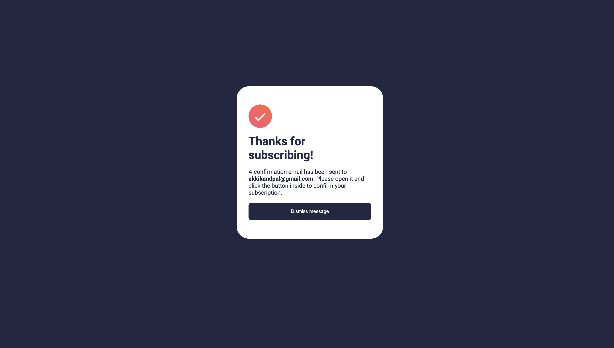
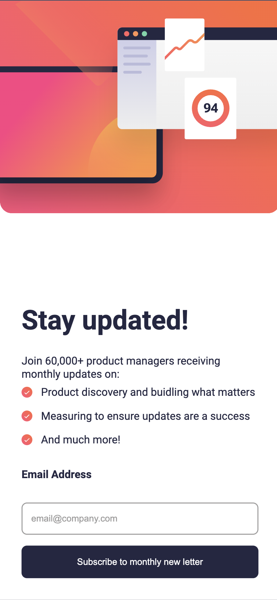
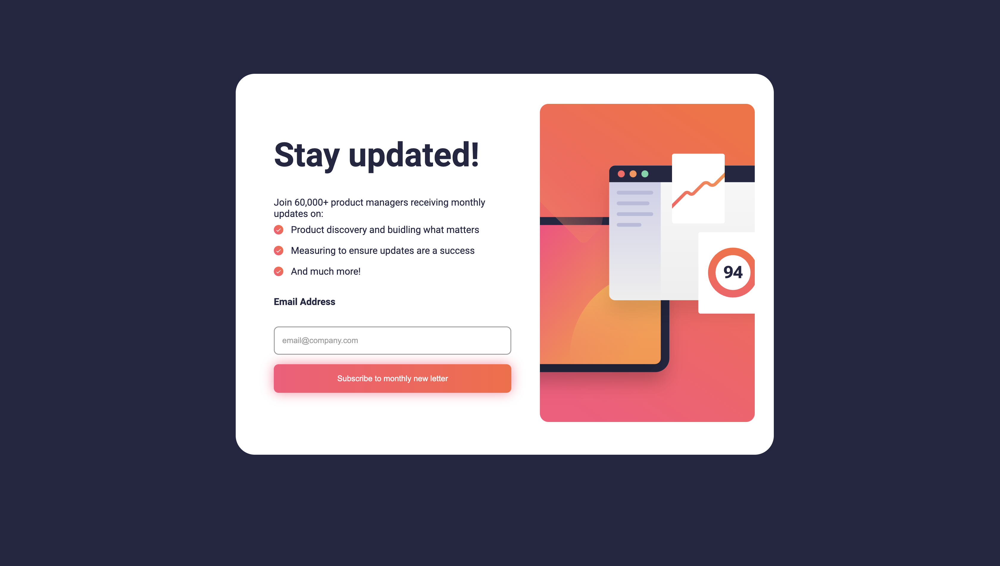
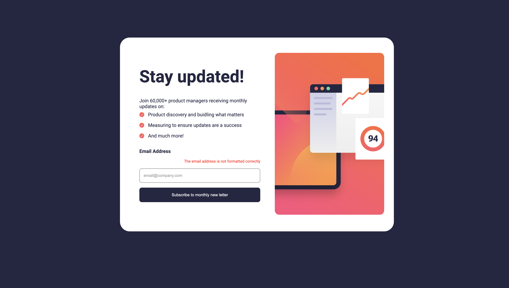

# Frontend Mentor - Newsletter sign-up form with success message solution

This is a solution to the [Newsletter sign-up form with success message challenge on Frontend Mentor](https://www.frontendmentor.io/challenges/newsletter-signup-form-with-success-message-3FC1AZbNrv). Frontend Mentor challenges help you improve your coding skills by building realistic projects.

## Table of contents

- [Overview](#overview)
  - [The challenge](#the-challenge)
  - [Screenshot](#screenshot)
  - [Links](#links)
- [My process](#my-process)
  - [Built with](#built-with)
  - [What I learned](#what-i-learned)
  - [Continued development](#continued-development)
- [Author](#author)

## Overview

### The challenge

Users should be able to:

- Add their email and submit the form
- See a success message with their email after successfully submitting the form
- See form validation messages if:
  - The field is left empty
  - The email address is not formatted correctly
- View the optimal layout for the interface depending on their device's screen size
- See hover and focus states for all interactive elements on the page

### Screenshot

### Links

- Solution URL: [news-letter-challenge](https://www.frontendmentor.io/solutions/newsletterchallenge-using-basic-html-css-and-js-yi9jvanDAc)
- Live Site URL: [news-letter-challenge](https://newsletter-signup-page-khaki.vercel.app/)

## My process

### Built with

- Semantic HTML5 markup
- CSS custom properties
- Flexbox
- Mobile-first workflow

### What I learned

i tried to make this newletter sign up page with html css and js only, and i was revising some concepts of html, css and js and i tried my best to make it look exactly like it was given in the challenge.

### Continued development

i want to improve my skills in frontend and i will try to get some experience in backend also.

## Author

- Frontend Mentor - [@Ashishkandpal](https://www.frontendmentor.io/profile/Ashishkandpal)
